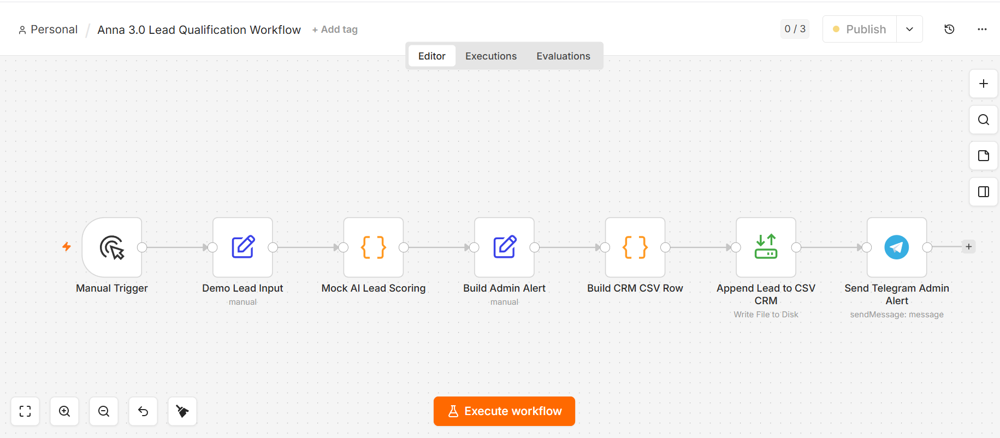
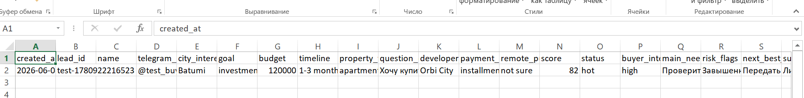
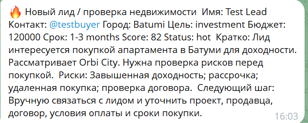

# Anna 3.0 — AI Real Estate Lead Qualification Workflow

Anna 3.0 is a demo AI workflow layer for real estate lead qualification.

The project demonstrates how a buyer inquiry can be structured, scored, logged into a lightweight CRM, and sent to an admin for manual review using n8n, Telegram, CSV storage, and human-in-the-loop automation.

## Project Goal

The goal of this project is to show a practical AI automation workflow for real estate lead qualification.

Instead of manually checking every incoming buyer inquiry, the workflow prepares a structured lead profile, assigns a lead score, identifies key risks, stores the lead in a local CRM file, and sends a Telegram alert to an admin for follow-up.

## Workflow Overview

Manual Trigger  
→ Demo Lead Input  
→ Mock AI Lead Scoring  
→ Build Admin Alert  
→ Build CRM CSV Row  
→ Append Lead to CSV CRM  
→ Send Telegram Admin Alert

## Features

- Demo real estate buyer lead input
- Mock AI lead scoring
- Buyer intent classification
- Risk flag generation
- Next-best-action suggestion
- CSV-based CRM logging
- Telegram admin notification
- Human-in-the-loop review
- Local Docker-based n8n setup
- No automatic outreach
- No spam logic

## Tech Stack

- n8n
- Docker
- Telegram Bot API
- JavaScript Code nodes
- CSV CRM
- Local file storage via Docker volume

## Example Use Case

A buyer is interested in purchasing an apartment in Batumi, Georgia for investment purposes.

The workflow processes the inquiry and produces:

- lead score
- buyer intent status
- key risk flags
- summary for admin
- suggested follow-up questions
- next-best-action recommendation

The lead is then logged into a CSV CRM file and a structured Telegram alert is sent to the admin for manual follow-up.

## Screenshots

### n8n Workflow

### CSV CRM Logging

### Telegram Admin Alert

## Workflow Export

The exported n8n workflow JSON is included in this repository:

[anna_3_0_lead_qualification_workflow_v1_0_demo_mvp.json](anna_3_0_lead_qualification_workflow_v1_0_demo_mvp.json)

## Human-in-the-Loop Design

This workflow does not send automatic messages to leads.

All lead review and follow-up actions remain manual. The system is designed to support an admin or real estate operator by preparing structured lead information, not to replace human decision-making.

## Current Status

Version: v1.0 Demo MVP

Implemented:

- working n8n workflow
- demo lead input
- mock AI scoring
- CSV CRM logging
- Telegram admin alert
- local Docker setup
- published n8n workflow version
- exported workflow JSON backup
- portfolio screenshots added to GitHub

## Next Steps

Planned improvements:

- replace mock scoring with real AI scoring
- connect real lead input sources
- add Google Sheets CRM integration
- add lead status tracking
- add improved CRM fields and status pipeline
- add optional voice layer in a future version

## Notes

This repository is a portfolio demo.

It does not include private credentials, bot tokens, `.env` files, real customer data, or production secrets.
